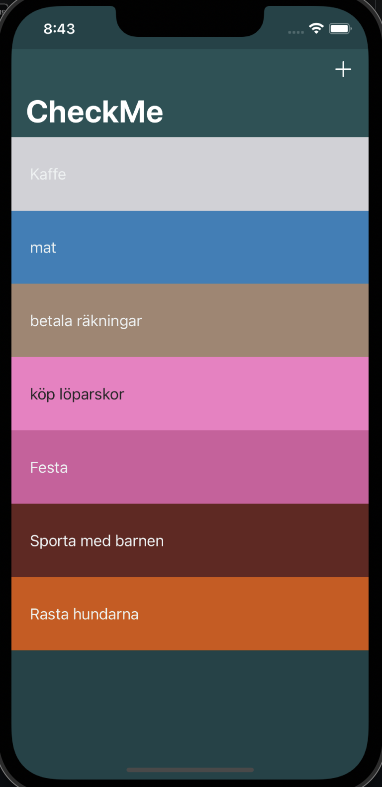
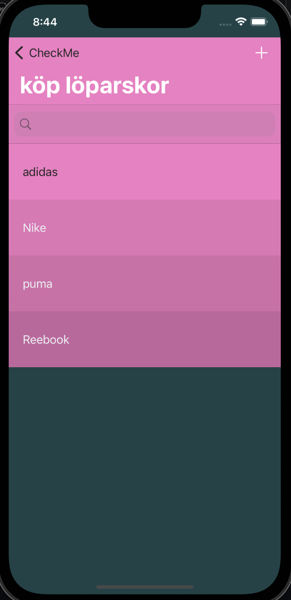

# CheckMe

När ni tankat hem projektet så i treminalen kör ni:
- `pod install`  
- [För doc](https://guides.cocoapods.org/using/pod-install-vs-update.html)

- Detta förutsätter att ni har installerat Cocoapods på eran Mac
- [Cocoapods](https://guides.cocoapods.org/using/getting-started.html)
- `sudo gem install cocoapods`

- Eller om ni har Homebrew på eran mac
- [Installera Homebrew](https://brew.sh) OBS! Ej om ni redan har Homebrew
- När det är färdigt kör ni detta:
- `brew install cocoapods`

 

